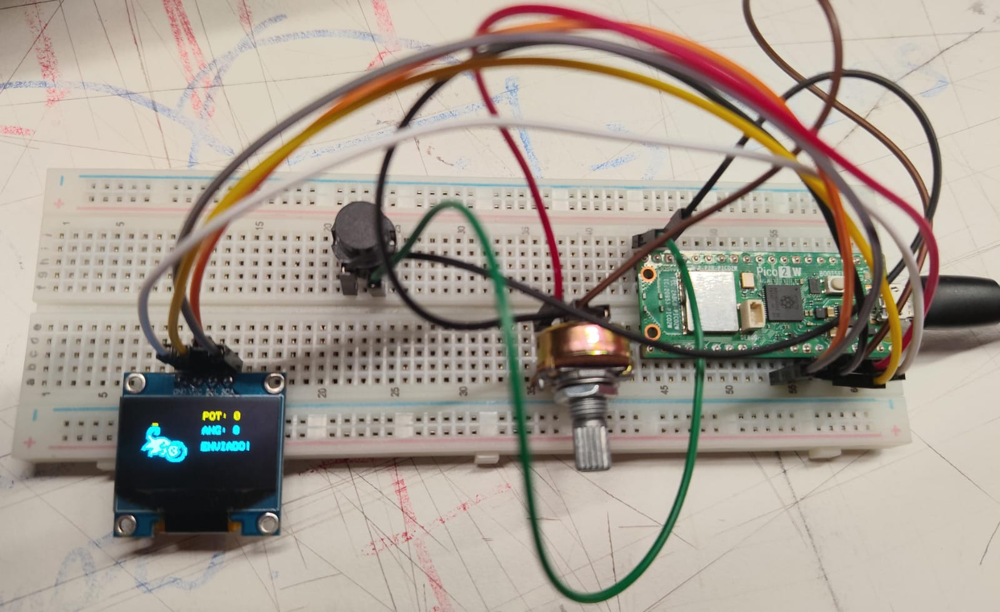
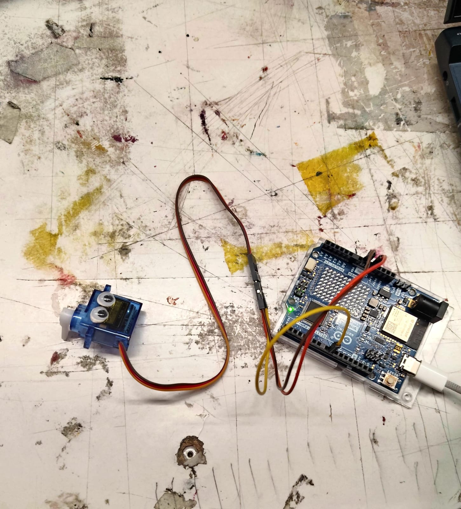

# investigaciones individuales

Angel David Sabogal Hernandez / angel-udp

En el traspaso de información es importante mirar cada detalle que puede hacer que no funcione y en este caso puede pasar que a pesar de tener bien el código que se sube a la nube, si los jumpers no están bien conectados a cada uno de los pines que deben ir en la Raspberry Pi Pico 2 W, podemos recaer en el fallo de pensar que es alguna parte del código o cualquier otra cosa, lo anoto como fallo de proceso porque a pesar de que llevamos un tiempo esto puede seguir pasando hasta cuando se tiene bastante experiencia.

Para la Pantalla OLED 128x84 px se debe implementar la app PuTTY que es la que hace que el código del dibujo digital y la figura que muestra en qué parte de los 180° se encuentra el movimiento de la perilla (parte izquierda).

## Sensor

El sistema de entrada está compuesto por un potenciómetro de 100k y un botón pulsador, ambos montados en la misma placa de pruebas (protoboard) junto a una Raspberry Pi Pico 2 W y una pantalla OLED.

- Funcionamiento: El potenciómetro actúa como el sensor analógico principal, al girar su perilla, genera una variación de voltaje que el microcontrolador interpreta como un ángulo deseado.

El botón opera como un mecanismo de confirmación, el sistema solo registra y envía la posición actual del potenciómetro cuando este es presionado.

- Conectividad y Comunicación: La Raspberry Pi Pico 2 W procesa estas señales y está conectada mediante un cable de USB a Micro-USB a una primera computadora portátil (estación de control).

Esta computadora opera de manera independiente a la que controla el actuador.

## Actuador

Los servomotores son dispositivos rotativos diseñados para ofrecer un control extremadamente preciso de la posición, la velocidad y el torque. A diferencia de los motores convencionales que giran continuamente, los servos se mueven a posiciones específicas y se corrigen en tiempo real ante cualquier alteración.

Entonces el servomotor utilizado en este caso es nuestro actuador, el cual se irá moviendo a medida que vayamos ajustando los grados desde nuestro sensor que serían 180° como máximo que se pueda mover (al menos en las pruebas que estuvimos haciendo con el código en clases).

Este va conectado a los pines del Arduino en otra protoboard diferente a la del sensor, el Arduino está conectado mediante cable USB a tipo C directamente a la computadora portátil.

## Bibliografía

- Adafruit Learning System. (s.f.). Monochrome OLED breakouts. Adafruit Industries.
- Arduino Documentation. (s.f.). Analog input. Arduino.
- Raspberry Pi Documentation. (s.f.). Pico series. Raspberry Pi Ltd.
- Raspberry Pi Projects. (s.f.). Physical computing. Raspberry Pi Foundation.
