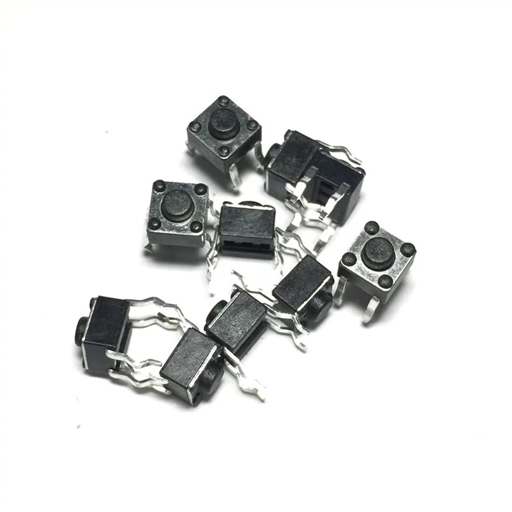
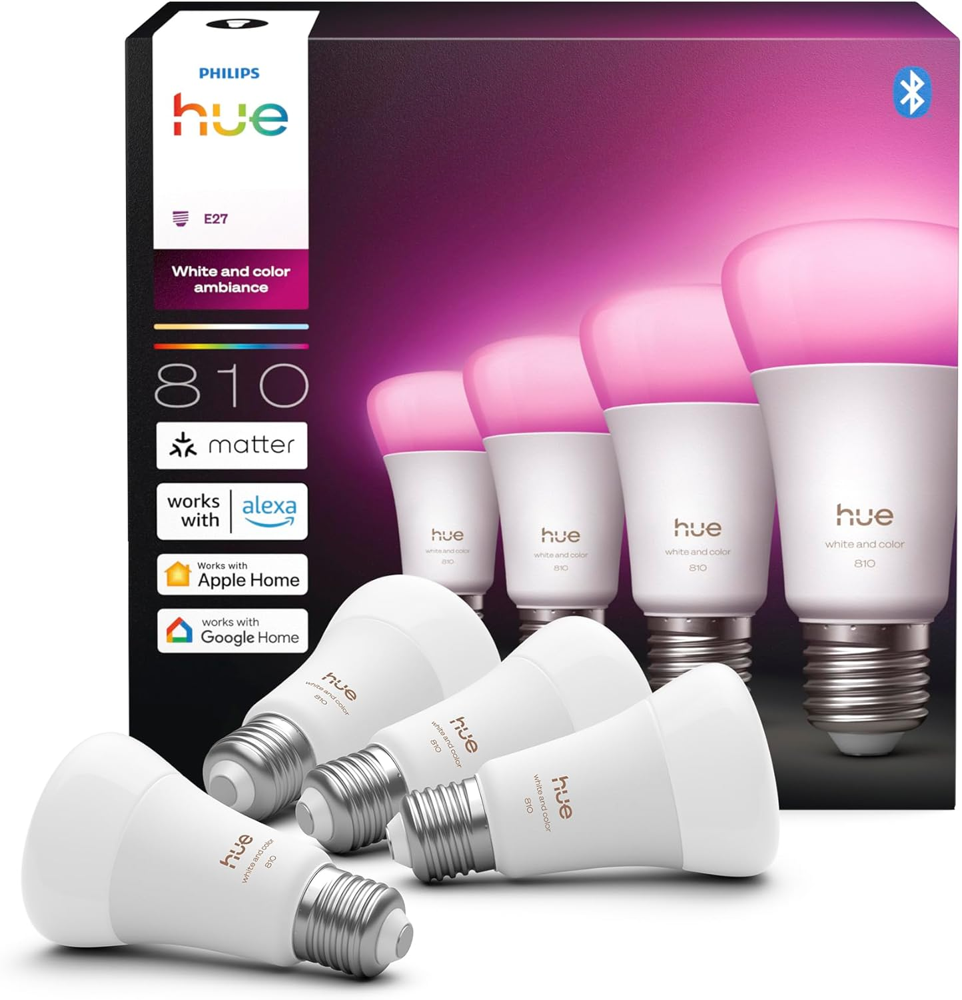

# investigaciones individuales

- Marlén Soto / github: [marlensoto-lab](https://github.com/marlensoto-lab)

## ¿Qué es un Sensor?
Un sensor es todo dispositivo que **detecta un estímulo y genera una señal eléctrica** como respuesta.

El botón pulsador cumple exactamente eso:

- **Estímulo:** presión mecánica del dedo
- **Respuesta:** señal eléctrica (circuito abierto o cerrado)

Por eso se clasifica como un **sensor mecánico discreto de contacto**, ya que detecta si existe o no una fuerza aplicada sobre él y lo traduce en una señal que un sistema puede leer y procesar.
## Sensor Utilizado: Botón Pulsador

## ¿Qué es un botón pulsador?

El botón pulsador es un componente electrónico que permite abrir o cerrar un circuito eléctrico al ser presionado. En proyectos IoT y automatización se utiliza como una entrada digital para activar o desactivar funciones dentro del sistema.

En este proyecto, el botón funciona como una “puerta lógica” que permite controlar cuándo se envían datos desde una Raspberry Pi Pico 2W hacia Adafruit IO, evitando enviar datos constantemente y previniendo la sobrecarga del servidor.

###  ¿Cómo funciona?

El botón tiene dos estados:

- PRESIONADO → activa el circuito
- NO PRESIONADO → mantiene el circuito apagado

Funcionamiento del sistema:

1. El usuario presiona el botón.
2. La Raspberry Pi Pico detecta la señal.
3. Se habilita el envío de datos hacia Adafruit IO.
4. El Arduino Uno R4 WiFi recibe la información.
5. Un LED indica visualmente el estado del sistema.

## Aprendizajes sobre el uso del sensor

Durante el desarrollo del proyecto se aprendió:

- Cómo leer entradas digitales.
- Cómo controlar el flujo de datos.
- Cómo evitar envíos innecesarios al servidor.
- Cómo conectar dispositivos IoT mediante WiFi.
- Cómo utilizar Adafruit IO para comunicación en tiempo real.

##  Filtrado de Información

Uno de los principales problemas del botón es el “rebote eléctrico” (debounce), donde una sola pulsación puede generar múltiples lecturas.

Para solucionarlo se utilizan:

- Debounce por software
- Temporizadores
- Pequeños retrasos (`delay()`)

Esto permite:

- Evitar errores.
- Mejorar estabilidad.
- Reducir tráfico innecesario hacia Adafruit IO.

##  Visualización de Datos

Los datos pueden visualizarse mediante:

- Monitor Serial de Arduino IDE
- Dashboard de Adafruit IO
- LEDs indicadores
- Interfaces web
- Aplicaciones móviles

Ejemplos:

- “Envío activado”
- “Sistema detenido”
- “Botón presionado”

##  Problemas Comunes

| Problema | Causa |
|---|---|
| Lecturas duplicadas | Rebote eléctrico |
| Botón no responde | Mala conexión |
| Activación constante | Error Pull-Up/Pull-Down |
| Retardo en respuesta | Problemas de WiFi |
| Error en Adafruit IO | Exceso de envíos |

##  Aplicaciones Reales

Los botones pulsadores son utilizados en:

- Sistemas de emergencia
- Botones de pánico
- Alarmas comunitarias
- Domótica
- Controles industriales
- Ascensores inteligentes

##  Empresa o Proyecto Relacionado

## Amazon Dash Button
 

Amazon desarrolló botones inteligentes llamados “Dash Buttons”, los cuales permitían ejecutar acciones automáticas al ser presionados mediante conexión a internet.

##  Conclusión

El botón pulsador es un sensor simple pero fundamental en electrónica e IoT. Permite controlar procesos físicos y optimizar sistemas conectados a internet, evitando errores y mejorando la eficiencia del envío de información.

## Actuador
###  Actuador Utilizado: LED Indicador

##  ¿Qué es un LED?

El LED (Light Emitting Diode) es un actuador electrónico que transforma energía eléctrica en luz. Es utilizado para mostrar estados, alertas y señales visuales dentro de sistemas electrónicos.

En este proyecto, el LED funciona como indicador visual del estado del envío de datos.

##  ¿Cómo funciona?

Cuando la Raspberry Pi o Arduino envían corriente eléctrica:

- El LED se enciende.

Cuando dejan de enviar corriente:

- El LED se apaga.

Estados posibles:

- LED encendido → envío activo.
- LED apagado → sistema detenido.

##  Aprendizajes sobre el actuador

Durante el proyecto se aprendió:

- Cómo controlar salidas digitales.
- Cómo sincronizar sensores y actuadores.
- Cómo representar información visualmente.
- Cómo mejorar la interacción usuario-sistema.

##  Filtrado de Información

Para evitar errores visuales:

- Se controla el tiempo de activación.
- Se sincroniza el LED con el envío de datos.
- Se limita el parpadeo innecesario.

Esto ayuda a:

- Mejorar estabilidad visual.
- Facilitar interpretación del estado del sistema.

##  Visualización de Datos

El LED permite representar:

- Sistema activo
- Conexión establecida
- Envío de datos
- Alertas o errores

##  Problemas Comunes

| Problema | Causa |
|---|---|
| LED no enciende | Polaridad invertida |
| Luz débil | Resistencia incorrecta |
| Parpadeo extraño | Error de programación |
| Sobrecalentamiento | Exceso de voltaje |
| No responde | Mala conexión |

# Aplicaciones Reales

Los LEDs son utilizados en:

- Paneles industriales
- Alarmas
- Semáforos
- Sistemas IoT
- Indicadores de estado
- Dispositivos inteligentes

##  Empresa o Proyecto Relacionado

## Philips Smart Lighting

Philips utiliza sistemas LED inteligentes en proyectos de:

- Iluminación urbana
- Hogares inteligentes
- Señalización automatizada
- Tecnología IoT

##  Conclusión

El LED es un actuador esencial en electrónica e IoT debido a su capacidad de representar información visual de manera rápida y eficiente. Permite mejorar la interacción entre usuario y sistema mediante señales claras y fáciles de interpretar.

## Bibliografía

- Arduino. (2025). *Arduino Official Website*. Recuperado de: https://www.arduino.cc/

- Adafruit Industries. (2025). *Adafruit IO Documentation*. Recuperado de: https://io.adafruit.com/

- Raspberry Pi Foundation. (2025). *Raspberry Pi Pico W Documentation*. Recuperado de: https://www.raspberrypi.com/documentation/

- ESPRESSIF Systems. (2025). *ESP32 Series Datasheet*. Recuperado de: https://www.espressif.com/

- Philips. (2025). *Smart Lighting Systems*. Recuperado de: https://www.philips.com/

- Amazon. (2025). *Amazon Dash Button Technology*. Recuperado de: https://www.amazon.com/

- HC-SR04 Ultrasonic Sensor Datasheet. (2025). Recuperado de: https://datasheetspdf.com/

- Servo Motor SG90 Datasheet. (2025). Recuperado de: https://components101.com/

- Wikipedia. (2025). *Push-button*. Recuperado de: https://en.wikipedia.org/wiki/Push-button

- Wikipedia. (2025). *Light-emitting diode*. Recuperado de: https://en.wikipedia.org/wiki/Light-emitting_diode

- Firebase. (2025). *Firebase Realtime Database*. Recuperado de: https://firebase.google.com/

- Google Developers. (2025). *Google Maps Platform*. Recuperado de: https://mapsplatform.google.com/
