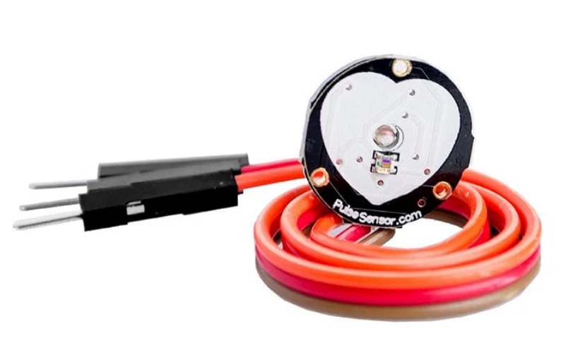
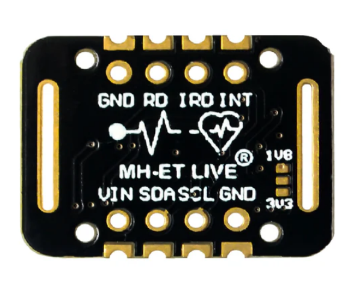
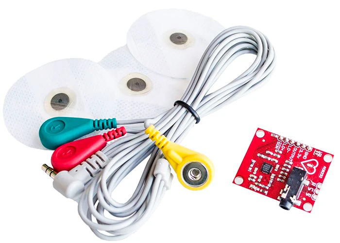

# investigaciones individuales

Cristobal Vergara Silva / cristobalvergarasilva

## Sensor

### Sensores de pulso cardiaco ESG y PPG ###

#### PPG, Fotopletismografía ####

Funciona emitiendo luz LED sobre la piel y midiendo cuánta luz rebota hacia un fotodetector. Esto funciona porque cada vez que el corazón late, llega más sangre a los vasos sanguíneos y eso cambia la cantidad de luz reflejada, generando una variación eléctrica. Contando esas variaciones se obtienen las pulsaciones por minuto (BPM), como es el caso del sensor de Pulse.sensor.com. El sensor más utilizado es el MAX30102 que mide también oxígeno en sangre, fabricado por Maxim Integrated. Este además de tener dos leds y un fotodetector, tiene un sensor de temperatura interno y como consume poca corriente es fácil hacer proyectos portátiles con él.

Algunos de los puntos débiles que tiene este sensor suceden por ejemplo si el usuario que se le está midiendo el pulso se mueve o si se aprieta demasiado el sensor, también si se está midiendo en el dedo puede tener problemas si tiene un esmalte de uñas muy grueso o si la temperatura corporal está muy alterada, también la luz ambiental tiene que estar preferiblemente controlada para que funcione mejor y sean más precisos los datos

Al ser tan versátil a veces se integra a los dispositivos inteligentes, como relojes y monitores de actividad deportiva, posibilitando el monitoreo de la frecuencia cardíaca durante los entrenamientos.

**PulseSensor.png**

**Max30102.png**

El ESG es un tipo de lectura que captura las ondas generadas por la contracción del músculo cardíaco durante el ciclo cardíaco, funciona detectando las células marcapasos naturales del corazón, que se localizan principalmente en los nódulos SA y AV, siendo el nódulo SA el que regula la frecuencia y el ritmo cardíaco. Ese recorrido eléctrico es el que detectan los sensores ESG a través de la colocación de electrodos que en ubicaciones estratégicas del cuerpo con un gel adhesivo electrocardiográfico, además se tienen que quitar los accesorios de metal y de preferencia que no haya vello en la piel donde se está midiendo. El procesamiento implica amplificación y filtrado para separar la información relevante del ruido eléctrico del entorno.

Un sensor conocido de este tipo es el AD8232, que está diseñado para extraer, amplificar y filtrar pequeñas señales en presencia de condiciones ruidosas, consta de un sensor, tres electrodos conectados por cable y un LED indicador que emite pulsos luminosos al ritmo del bombeo del corazón, además se puede controlar con un Arduino o una Lilypad

Uno de los pocos contras del ESG es que deben detectar la actividad bioeléctrica a través solo ciertas áreas del cuerpo como las yemas de los dedos, el pecho y las axilas, pero es una forma de medir el ritmo cardiaco muy poco invasiva y no se requiere ni un cuidado especial después de aplicarlo.

**AD8232**

### Obra de artista ###

Me llamó la atención Pulse Room del artista digital Mexicano, Rafael Lozano-Hemmer, la obra es una intervención artística que está compuesta por dos partes, por un lado tenemos una consola que detecta la frecuencia cardiaca, y por el otro lado tenemos una serie de ampolletas led, que en algunas ocasiones llegaron a ser 300, y estas dos partes dialogan de la siguiente manera: cuando se toca la consola, el sensor incorporado, específicamente un ESG Vernier Hand-Grip Heart Rate Monitor, registra el ritmo cardiaco y las luces comienzan a prenderse y apagarse imitando las pulsaciones, desplazándose de tal forma que el ritmo del último usuario se imprime en la primera ampolleta y va empujando los ritmos de los visitantes anteriores a las hileras más lejanas de ampolletas.

¿Cómo funciona el sensor?

Este sensor de Vernier mide la frecuencia cardíaca registrando señales eléctricas que se transmiten a través de la superficie de la piel cada vez que el corazón se contrae y detecta cada señal eléctrica del corazón mediante los electrodos de los agarres. La información de la frecuencia cardíaca se transmite de forma inalámbrica a los dispositivos compatibles mediante Bluetooth

**Vernier Hand-Grip Heart Rate Monitor**

**Plataforma, Fábrica La Constancia, Puebla, México, 2006**

**Enter Action-Digital Art Now, ARoS Aarhus Kunstmuseum, Aarhus, Denmark, 2009**

## Actuador

### Steppers motors o motor paso a paso ###

Un motor paso a paso es un actuador eléctrico que permite el posicionamiento preciso con facilidad, son ideales para respuestas rápidas y por su diseño, mantienen su posición al detenerse de forma muy precisa, su característica principal es que su eje gira a través de una serie de pasos, tal como dice su nombre, cada "paso" está en una posición distinta del motor, por ende en distintos grados.
Estos motores constan de dos piezas muy importantes, un rotor que es el corazón del actuador, la pieza central que gira, que es un imán permanente con dos piezas, la copa norte y sur, y cada una tiene una serie de dientes no alineados en su exterior, al rededor tenemos el estator que no gira y que tiene una serie de bobinas de alambre que rodean al rotor, y al alimentar de energía las distintas bobinas, se genera un campo magnético que hace que gire dependiendo cuál recibe energía, puesto que estas atraerán y repelerán el campo magnético de las copas norte y sur del rotor o en otras palabras, la bobina que se energice va a hacer que el rotor se alinee con el campo magnético que produce.

### Proceso de funcionamiento ###

### Obra de artista ###

La obra que escogí son los espejos mecánicos de Daniel Rozin, la primera de sus obras fue Wooden Mirror (1999), que fue por la que me interese en su trabajo, esta consiste en una serie de espejos con 835 piezas de madera de pino con cientos de motores por detrás, además tiene una cámara que procesa lo que ve en píxeles.
Las primeras versiones de sus obras fueron hechas con servo motors, pero según una entrevista a el del canal WIRED (2018), no le servían para mantener una obra las 24 horas del día, porque dejaban de funcionar, y ahí fue cuando comenzó a utilizar los Steppers motors completamente metálicos que ayudaban a que no se rompieran de tanto usarlos. También en sus últimas obras remplazo las cámaras que transformaban la imagen a píxel por sensores de movimiento, y con el tiempo fue experimentando con distintos materiales que no tienen reflejo como basura, abanicos, trolls de dos colores, pompones y pingüinos.
Reflejan lo que ven gracias que el software calcula qué tan oscuro o claro debe ser cada "píxel", y le ordena al motor de ese objeto que rote exactamente al ángulo necesario para lograr ese brillo, funcionando como unos y ceros. Lo que hace el motor es rotar para controlar cuánta luz llega al ojo del espectador, como en Wooden Mirror, o en otros los motores rotan el objeto para mostrar una cara oscura o una cara clara, lo que genera el contraste de la imagen, como en Trolls Mirror.

### Penguins Mirror ### 

### Espejos mecanicos ###

## Bibliografía

### Sensor: ###

Página del artista Lozano Hemmer: https://www.lozano-hemmer.com/pulse_room.php

Teoría del Pulse.sensor: https://pulsesensor.com/pages/pulsesensor-manual

Max30102: https://afel.cl/products/sensor-pulsioximetria-max30102?srsltid=AfmBOooQsCS0TE0x-UjsNl8IM3HjaWYF2Kxkyd0HIkJtS6jv7nIKT0D3

Pulse.Sensor: https://afel.cl/products/sensor-pulso-cardiaco-corazon?srsltid=AfmBOoo6FuucuOXlNX7iixlNmI2xyjE65Wf7BrylaO0yiD9LFT9xGvdn

Teoría completa del ECG: https://www.ncbi.nlm.nih.gov/books/NBK549803/

Que es un electrocardiograma: https://www.hopkinsmedicine.org/health/treatment-tests-and-therapies/electrocardiogram

Texto explicativo con materiales utilizados: https://lozano-hemmer.com/texts/manuals/pulse_room.pdf

Manual del sensor de Vernier: https://www.vernier.com/manuals/hgh-bta/

ECG AD8232: https://afel.cl/products/sensor-de-frecuencia-cardiaca-ecg-ad8232-electrocardiograma?srsltid=AfmBOopYP_7LkrLpaht21A0eqfAAw322Z6hBqR8DJjKYcIm8YedOaLAW

### Actuador 

Entrevista a Daniel Rozin: https://www.youtube.com/watch?v=kV8v2GKC8WA

Explicación de Steppers motors: https://www.monolithicpower.com/en/learning/resources/stepper-motors-basics-types-uses

Video explicativo Steppers motors: https://www.youtube.com/watch?v=b_-PQCjyRRQ

Todas sus obras: https://www.smoothware.com/danny/index.html

Explicando su arte: https://www.youtube.com/watch?v=Rc76x8NYzhU
