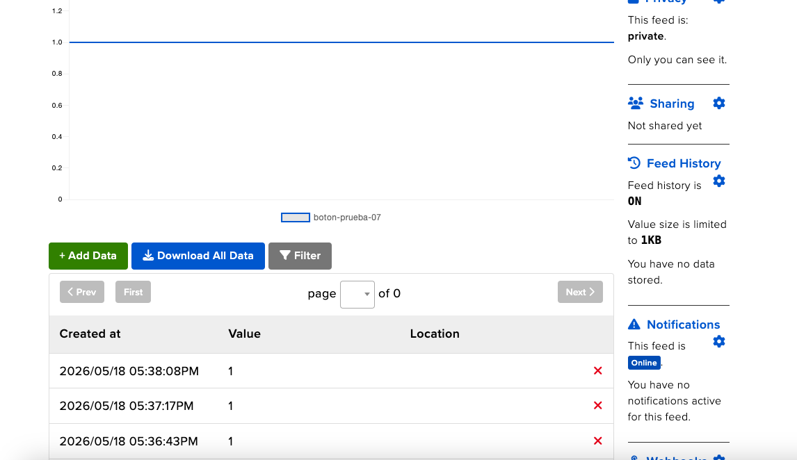
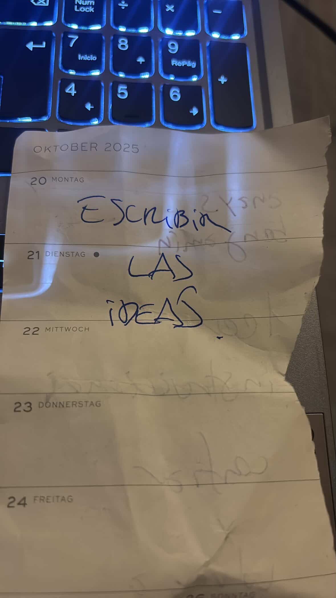
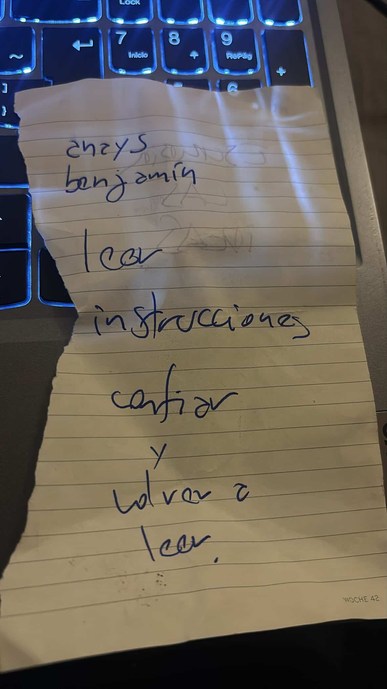

# sesion-10

lunes 18 mayo 2026

Trabajamos en la solemne, con anays terminamos de elegir con que íbamos a trabajar para esta entrega. Escogimos un sensor pir que detecta movimiento, funcionando junto a la Raspberry pi Pico 2 w y que enviara la info a Adafruit IO, para después con la placa Arduino UNO R4 Wifi y que terminará reflejando una especie de gif de alguien caminando, sea un fantasma, alien o humano. después nos enteramos que teníamos que usar un botón para ambas placas, que funcionase par no saturar el adafruit, así que nos dedicamos a hacer que funcionase el botón

```python

import time
import board
import digitalio
import wifi
import socketpool
import adafruit_minimqtt.adafruit_minimqtt as MQTT

print("Iniciando programa...")

# -------------------------
# WiFi
# -------------------------
SSID = "bla"
PASSWORD = "bla"

print("Conectando WiFi...")

try:
    wifi.radio.connect(SSID, PASSWORD)
    print("WiFi conectado")
    print("IP:", wifi.radio.ipv4_address)

except Exception as e:
    print("Error WiFi:")
    print(e)

    while True:
        pass


# -------------------------
# Adafruit IO
# -------------------------
AIO_USERNAME = "bla"
AIO_KEY = "bla"

FEED_BOTON = AIO_USERNAME + "/feeds/boton-prueba-07"

print("Creando conexión MQTT...")

pool = socketpool.SocketPool(wifi.radio)

mqtt = MQTT.MQTT(
    broker="io.adafruit.com",
    username=AIO_USERNAME,
    password=AIO_KEY,
    socket_pool=pool,
)

print("Conectando a Adafruit IO...")

try:
    mqtt.connect()
    print("Conectado a Adafruit IO")

except Exception as e:
    print("Error MQTT:")
    print(e)

    while True:
        pass


# -------------------------
# Botón GP0
# -------------------------
boton = digitalio.DigitalInOut(board.GP0)
boton.direction = digitalio.Direction.INPUT
boton.pull = digitalio.Pull.UP

estado_anterior = True

print("Sistema listo")

# -------------------------
# Loop principal
# -------------------------
while True:

    try:
        mqtt.loop()

        estado_actual = boton.value

        # Detecta transición:
        # sin presionar -> presionado
        if estado_anterior and not estado_actual:

            print("Botón presionado")
            print("Enviando impulso...")

            mqtt.publish(FEED_BOTON, "1")

            print("Impulso enviado")

            # anti-rebote
            time.sleep(0.25)

        estado_anterior = estado_actual

    except Exception as e:
        print("Error:")
        print(e)

    time.sleep(0.02)
```


## Notas que me dio Aaron en clase






