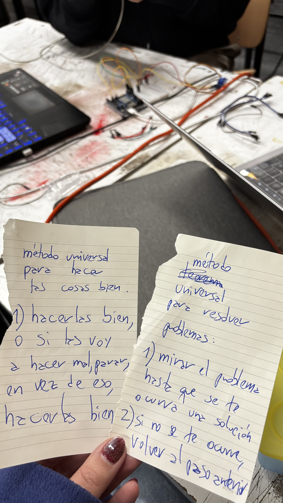
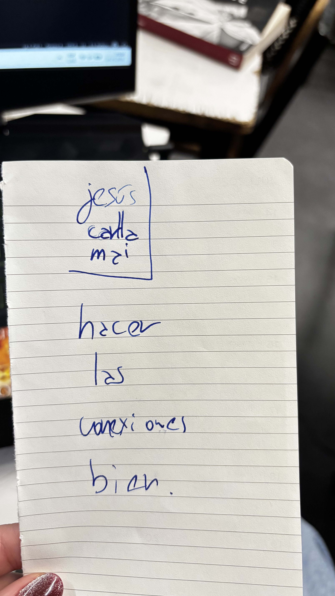
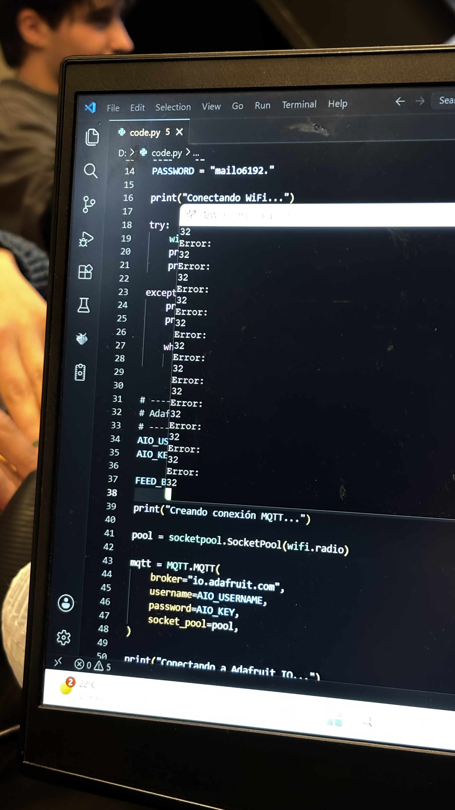
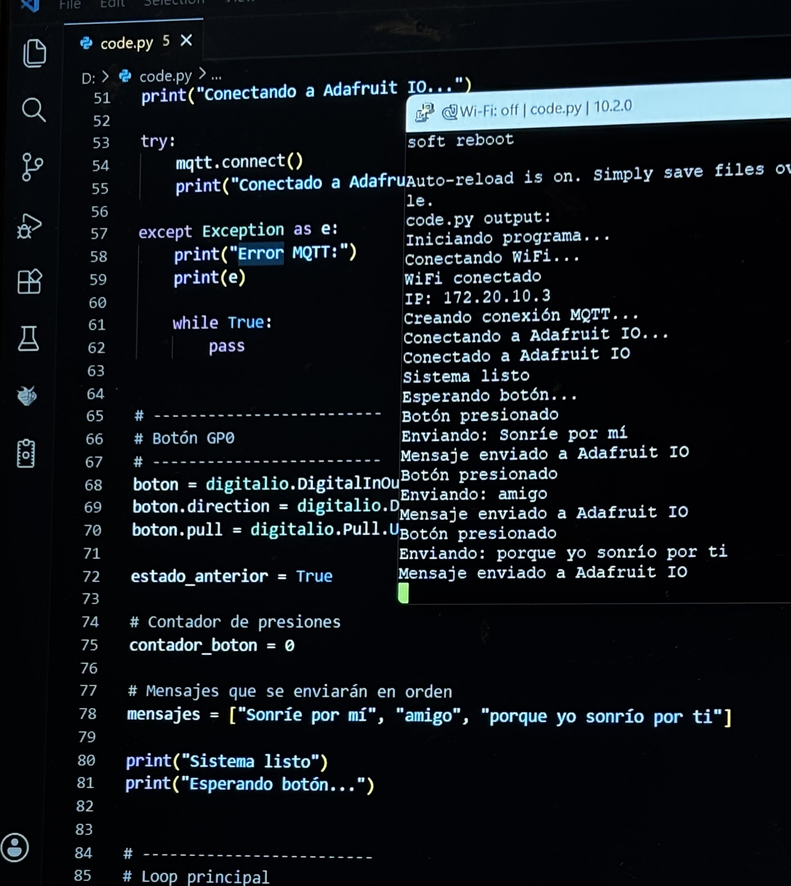
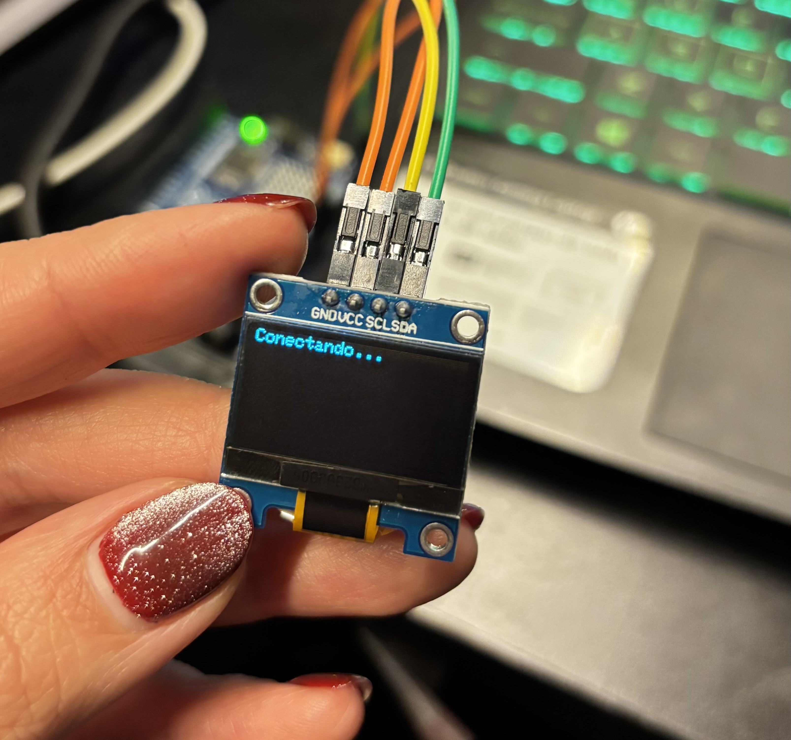
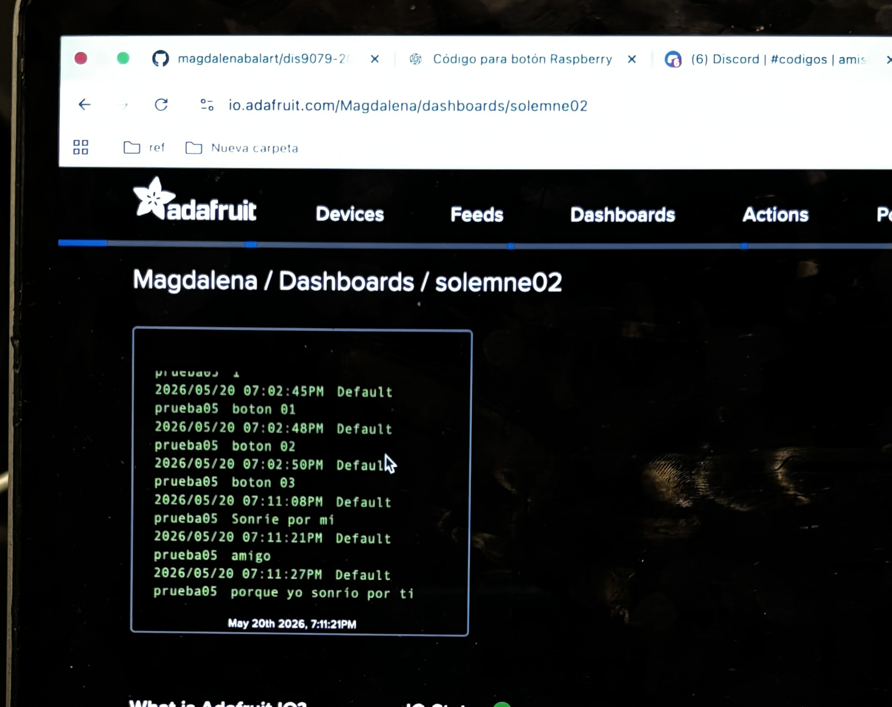

# sesion-10

lunes 18 mayo 2026

> preparación solemne 2

En esta clase trabajamos en la solemne 2, en la cual determinamos qué elementos utilizaríamos, qué microcontrolador enviaría y cuál recibiría. También escogimos el sensor y el actuador. Hicimos ciertas pruebas con un actuador que vendría siendo el servomotor, el cual no terminamos usando porque queríamos algo más. Si bien los códigos que utilizamos nos funcionaron, en esta ocasión al hacerles ciertos ajustes para ocuparlos en el actuador real fue muy engorroso. Hubo frustración y ganas de rendirse, pero tomamos aire, nos reímos y terminó resultando. Le comentamos algunos de nuestros baches a Aaron y él respondió con sabios consejos.

> consejos que nos ayudaron a seguir a pesar de la adversidad, como la vida misma

# trabajo entre semana 

Nos juntamos durante la semana a trabajar en la Solemne en el LID, donde Aarón, Nicolás V. y Seba (muy seco él, no sé su apellido; ese día fue la primera vez que tuve una conversación con él), todos muy secos, fueron de gran ayuda para no caer en la locura y ver las cosas desde otra perspectiva. Hay veces en las que por estar tan inmersos en el error, no vemos la posibilidad de poder hacer las cosas bien.
Durante este proceso empezamos a experimentar con los códigos y las conexiones de nuestro sensor al microcontrolador, siendo este la Raspberry Pi Pico 2W. Al principio tuvimos problemas de cableado y problemas de conexión a internet. Fue aquí cuando Seba me recomendó leer y enviarle el código que estaba utilizando a Claude (IA), para que me ayudara, ya que ninguno entendía. Reiniciamos mil veces la Raspi, cambiamos la red, el código, y finalmente decidió funcionar. Cuando solucionamos eso, logramos que el sensor, que era un botón, enviara un mensaje a la nube de Adafruit. YEIII! celebramos mucho.
Luego probamos nuestro actuador con el segundo microcontrolador, que fue un Arduino R4 WiFi con una pantalla OLED conectada, donde se proyectaría finalmente el mensaje que estábamos enviando a la nube!!!. 

> el error más desagradable

> logro con nuestro sensor

> pantallita conectando para recibir nuestros mensajitos

> feed de nuestra nube en Adafruit yeiii

