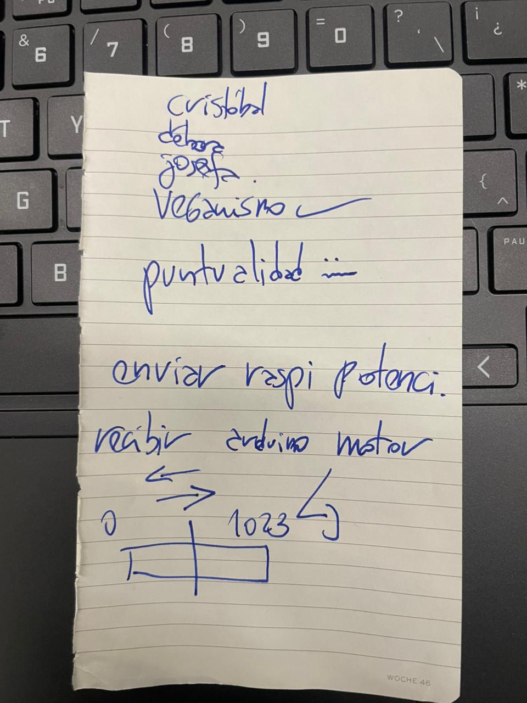
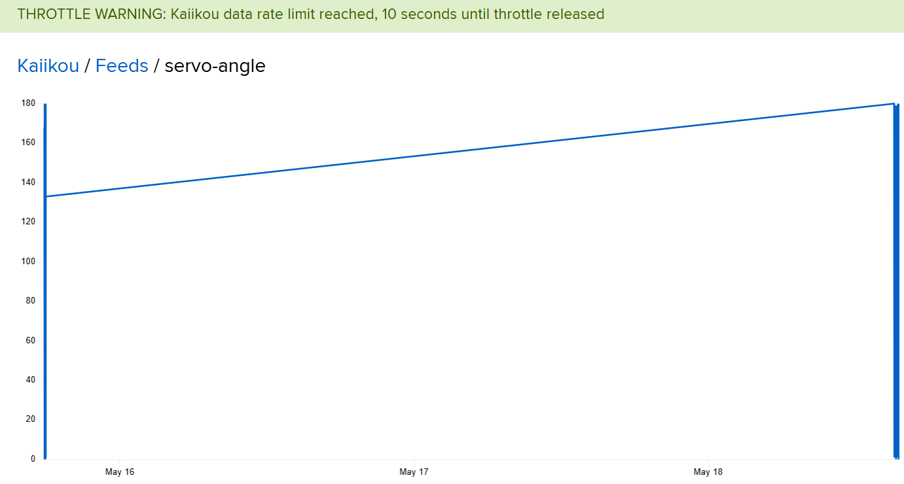
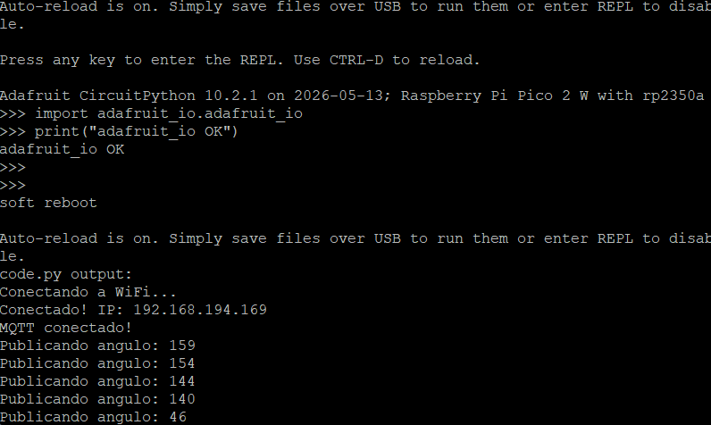
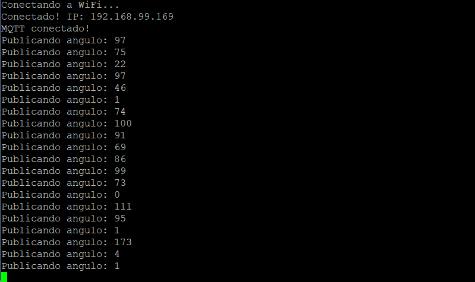
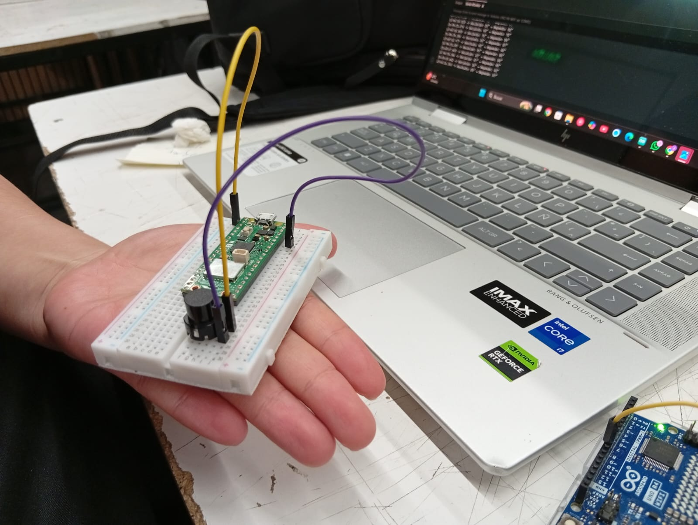
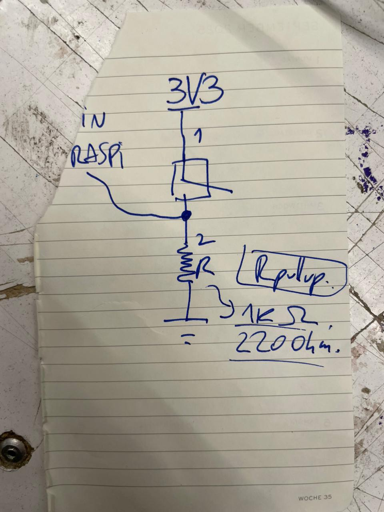
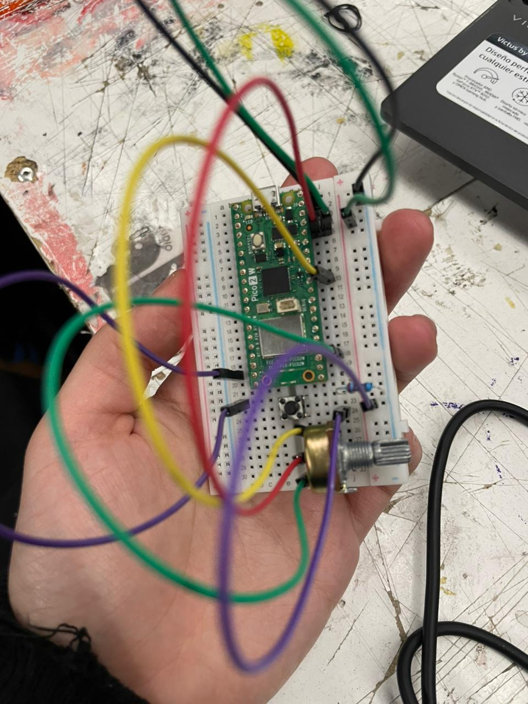
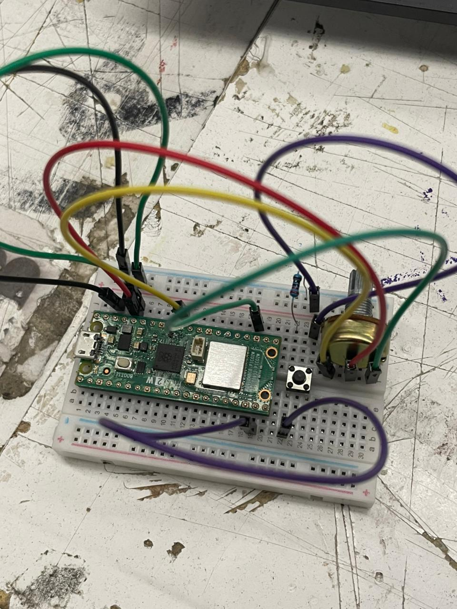

# sesion-10

lunes 18 mayo 2026

La clase del día de hoy fue mostrarle nuestros avances a Aarón, le comentamos que logramos conectar la Raspberry Pi Pico 2w con CircuitPython 10.2.1, con el potenciómetro en el pin GP26, con sus valores publicados vía MQTT a nuestro feed en Adafruit IO, y a través de ahí, controlar un servo motor conectado al pin 9 un Arduino Uno r4 WIFI.

Nos comentó que no estaba mal, pero que teníamos que buscarle un lado más poético al proyecto, le comentamos que queríamos hacer una guillotina cortándole la cabeza a Kast y nos comentó que no valía la pena darle protagonismo a él, así que nos sugirió no hacer eso puntualmente, además de decirnos que hiciéramos algo más interesante con como se movía el servo, que lo teníamos moviéndose de 0 - 180 y lo cambiamos a 45 - 135.

Solo publicaba cuando el ángulo cambia más de 2° para no superar el límite de 30 mensajes por minuto de Adafruit IO gratuito, pero aun así sobrecargo mi Feed de Adafruit IO así que lo pusimos para que enviara datos cada 5 segundos en la línea:
if abs(angle - last_angle) = 2 and (now - last_send_time) = 5

Luego el profe no sugirio hacer algo mas respecto a la sobrecarga de datos, y fuimos a hablar con el grupo de Nicolas Valdes y nos comentaron que estaban utilizando un boton, nos explciaron un poco como se concectaban los cables mientras tanto nosotros les prestamos nuestra Raspi para que comprobaran si la suya estaba funcionando mal.
Estuvimos lo que quedaba de clase leyendo sobre el boton.

https://docs.sunfounder.com/projects/pico-2w-kit/en/latest/cproject/ar_button.html

Encontramos este sitio y seguimos las instrucciones que aparecían ahí, en un inicio tratamos de hacer la conexión con un resistor de 220 como nos lo graficó el profe, pero en el sitio aparecía un código para utilizar el resistor interno del botón y tratamos de aplicarlo.

Luego de implementar en nuestro código los fragmentos del sitio, lo corrimos y de cierto modo si funciono, solo que en vez de servir el botón para enviar y dejar de enviar dato a la nube, ahora solo se enviaban datos cuando movíamos el potenciómetro (antes se enviaban siempre cada 0.2 segundos).

